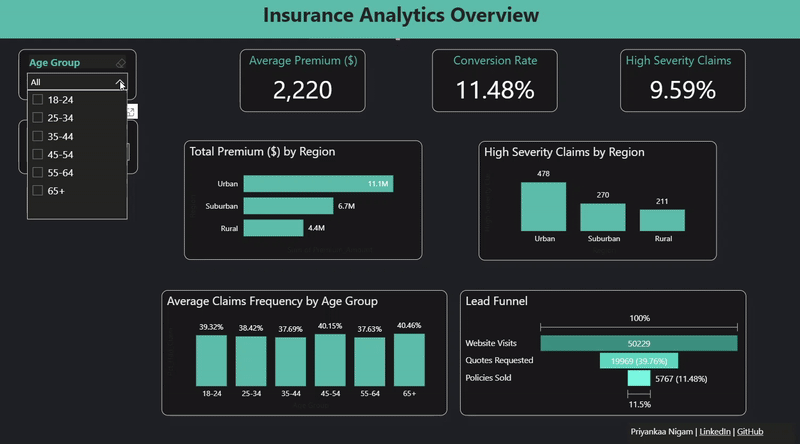

# Insurance Analytics Dashboard (Power BI)

This project analyzes synthetic insurance data to evaluate premium distribution, claim frequency,lead funnle performance, and severity of claims.The goal is to provide insights into customer behavior across demographics and regions, while highligting conversion perfromance in insurance lifecycle.
---

### Data Source:   
[https://www.kaggle.com/datasets/vipin20/loan-application-data](https://www.kaggle.com/datasets/samialyasin/insurance-data-personal-auto-line-of-business)

Synthetic dataset with 10,000 rows simulating real-world insurance activity.

### Steps:
1.  **Data Cleaning & Transformation (Power Query)**:
    * Promoted headers and verified data types.
    * Removed irrelevantcolumns.
    * There were no missing values in columns.

2.  **DAX Calculations**:
   
      Created key performance indicators (KPI): 
     * Conversion Rate (Web to Policy) = DIVIDE(SUM(synthetic_insurance_data[Conversion_Status]), SUM(synthetic_insurance_data[Website_Visits]))
     * High Severity Claims = CALCULATE(COUNTROWS(synthetic_insurance_data), synthetic_insurance_data[Claims_Severity]="High")  
     * Pct High Severity Claims = DIVIDE([High Severity Claims], COUNTROWS(synthetic_insurance_data))
     * Pct With Any Claim  = DIVIDE(COUNTROWS(FILTER(synthetic_insurance_data,synthetic_insurance_data[Claims_Frequency]>0)), COUNTROWS(synthetic_insurance_data),0)  
      
3.  **Dashboard Design**:
   
      Developed a clean, user-friendly dashboard with a dark theme. 
      The dashboard features:
      * **KPI Cards**: Average Premium, Conversion Rate, % High Severity Claims.
      * **Interactive Slicers**: Age Group, Marital Satus.
      * **Visualizations**: Bar Charts, Column Charts, and Funnel
        1. Total Premium ($) by Region 
        2. High Severity Claims by Region
        3. Average Claims Frequency by Age Group
        4. Lead Funnel (Website Visits, Quotes Requested, Poliies Sold)
           
 4.  **Publishing**:
    
      Published dashboard to Power BI Service for interactive exploration.

### Results
 [View the Interactive Dashboard Live](https://app.powerbi.com/view?r=eyJrIjoiMjJhYmIyYTItY2RhYi00MmU3LTkwODItZjE0NDBhYzZlZDMzIiwidCI6IjY2OTA5YjAzLWIxZDctNDNmYS05YmUyLTMzMmVmYzQ1YWUxMCIsImMiOjZ9)

### Key Insights

1.  Urban customers contribute the largest share of total premiums (11.1M).
2.  Lead funnelanalysis shows a 60% drop-off from website visits to quotes and 65% drop-off from quotes to polices, yielding only an 11.5% overall conversion rate.
3.  Claims frequency is fairly consistent accross age groups (ranges 37-40%), but widowed 18-24 policyholders show the hihgst frequency (48%).
4.  Divorced policyholders aged 55-65 years record the highest share of high severity claims (13.5%). 

### Tools

* **Power BI Desktop**
* **Power Query (M Language)**
* **DAX (Data Analysis Expressions)**
