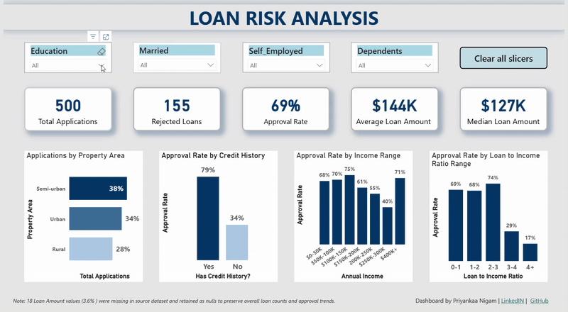

# Loan Application Risk Analysis Dashboard (Power BI)

This project analyzes loan application data to identify approval patterns, borrower risk factors, and the impact of financial and demographic variables on loan outcomes. The goal is to provide insights into what makes an ideal borrower profile vs. a high-risk profile using an interactive Power BI dashboard.
---

### Data Source:   
https://www.kaggle.com/datasets/vipin20/loan-application-data

### Steps:
1.  **Data Cleaning & Transformation (Power Query)**:
    * Promoted headers and verified data types.
    * Removed the irrelevant Loan_ID column.
    * Handled missing values in categorical columns (Married, Self_Employed) by replacing empty strings with "Unknown."
    * Addressed missing numerical data in Credit_History column by replacing "null" with "0."
    * Recoded Credit_History column to categorical ( "1" ="Yes" and "0" = "No.")
    * Converted Dependents column from numerical to categorical and replaced missing data with "Unknown"
    * Formated text in Property_Area column (Semiurban --> Semi-urban).
    * Addressed 18 missing values (3.6%) in LoanAmount column and 12 missing values in Loan_Amount_Term (2.8%) by retaining them as "null" to maintain counts.

2.  **DAX Calculations**:
   
      Created key performance indicators (KPI): 
     * Total Application = COUNTROWS('df1_loan')
     * Rejected Loan Count = CALCULATE(COUNTROWS('df1_loan'), df1_loan[Loan_Status] = "N")  
     * Approval Rate = DIVIDE(CALCULATE(COUNTROWS('df1_loan'), df1_loan[Loan_Status] = "Y"), COUNTROWS('df1_loan'))  
     * Average Loan Amount ($) = FORMAT(AVERAGE(df1_loan[LoanAmount]), "$0K")  
     * Median Loan Amount ($) = FORMAT(MEDIAN(df1_loan[LoanAmount]), "$0K")
       
3.  **Dashboard Design**:
   
      Developed a clean, user-friendly dashboard with a custom "University of Melbourne" JSON theme. 
      The dashboard features:
      * **KPI Cards**: Total Applications, Rejected Loans, Approval Rate, Average Loan Amount, and Median Loan Amount.
      * **Interactive Slicers**: Education, Marital Status, Employment Type and Dependents.
      * **Visualizations**: Bar and Column Charts
        1. Applications by Property Area
        2. Approval Rate by Credit History
        3. Approval Rate by Income Range
        4. Approval Rate by Loan-to-Income ratio
           
 4.  **Publishing**:
    
      Published dashboard to Power BI Service for interactive exploration.

### Results
 [View the Interactive Dashboard Live](https://app.powerbi.com/view?r=eyJrIjoiYTRhZWJiNTQtNmVkOS00ZjE2LTkxNTItYjBkZTZhM2NhNTMwIiwidCI6IjY2OTA5YjAzLWIxZDctNDNmYS05YmUyLTMzMmVmYzQ1YWUxMCIsImMiOjZ9)

### Key Insights

1. **Credit history drives approval** - Applicants with credit history had nearly 80% approval, compared to less than 40% for those without.
2. **Middle-income anomaly** - Approval dips in the $150K-$300K income range, explained by missing credit history rather than income.
3. **Semi-urban applicants dominate** - Semi-urban applicants have the largest share of loan applications (around 38%).
4. **Education Matters** - Graduates have higher loan approval rates than non-graduates.
5. **Marital status boosts approval** - Married applicants have higher approval rates than singles.
6. **Employment type and numner of dependents have little impact** - Neither significntly changes approval outcomes.
7. **Loan-to-Income ratio is criticl** - Ratios > 3 sharply reduces approval rates.
8. **Borrower Profiles:**  
    *Ideal:* Graduate, married, semi-urban, employed, established credit history, loan-to-income ratio < 3.  
   *High Risk:* Non-graduate, single, rural, self-employed, dependents, no credit hstory, loan-to-income ratio > 3.

### Tools

* **Power BI Desktop**
* **Power Query (M Language)**
* **DAX (Data Analysis Expressions)**

Acknowledgments:
* **Theme**: University of Melbourne theme from the [Power BI Community Themes Gallery](https://community.fabric.microsoft.com/t5/Themes-Gallery/University-of-Melbourne/td-p/163417).
