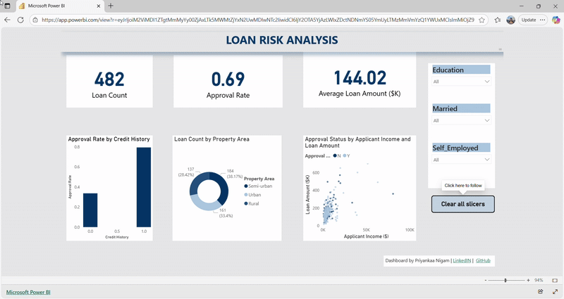

# Loan Application Risk Analysis Dashboard with Power BI

This repository contains an end-to-end Power BI project designed to analyze risk factors associated with loan applications. The goal was to transform raw, messy data into a clean, interactive, and insightful dashboard that could help a financial institution make better data-driven decisions.
---

### Data Source:   
https://www.kaggle.com/datasets/vipin20/loan-application-data

### Steps:
1.  **Data Cleaning & Transformation (Power Query)**:
    * Promoted headers and verified data types.
    * Removed the irrelevant `Loan_ID` column.
    * Handled missing values in categorical columns (Married, Self_Employed) by replacing both "null" and empty strings with "Unknown."
    * Addressed missing numerical data in Credit_History column by replacing "null" with "0." 
    * Formated text in Property_Area column (Semiurban --> Semi-urban).
2.  **DAX Calculations**: 
      Created a key performance indicator (KPI) for **Approval Rate** using DIVIDE and `CALCULATE` functions.  
3.  **Dashboard Design**: 
      Developed a clean, user-friendly dashboard with a custom "University of Melbourne" JSON theme. 
      The dashboard features:
      * **KPI Cards**: At-a-glance metrics for Total Applications, Approval Rate, and Average Loan Amount.
      * **Interactive Slicers**: Filters for Education, Marital Status, and Employment Status.
      * **Visualizations**: Column, Donut, Scatter charts.
 4.  **Publishing**: 
      Published the final report to the Power BI Service to enable online access and sharing.

### Results
 [View the Interactive Dashboard Live](https://app.powerbi.com/view?r=eyJrIjoiM2ViMDI1ZTgtMmMyYy00ZjAxLTk5MWMtZjYxN2UwMDIwNTc2IiwidCI6IjY2OTA5YjAzLWIxZDctNDNmYS05YmUyLTMzMmVmYzQ1YWUxMCIsImMiOjZ9
)

### Key Insights

### 1. Credit history is the deciding Factor
 * **The Finding**: Applicants with an established credit history (value of 1.0) have an approval rate of about **79%**, while those without a credit history (value of 0.0) have an approval rate of only **34%**.
 * **Business Implication**:  Lenders consider an absence of a credit history to be a major red flag. It is a primary criterion for screening applicants and risk assessment.

### 2. A clear profile of an *ideal borrower* can be derived
* **The Finding**: A married graduate with an established credit history and living in a Semi-urban area has has an **83%** approval rate and an average loan of **$159K**.
* **Business Implication**: This provides a clear "target customer" profile for the bank's marketing and risk assessment teams. 

### 3. Employment type is not a major risk factor
* **The Finding**: The approval rate for self-employed applicants (**68%**) is virtually identical to that of non-self-employed applicants (**69%**).
*  * **Business Implication**: The bank's risk model does not seem to penalize self-employed applicants, suggesting that it determines financial stability using other merics such as income.

### Tools

* **Power BI Desktop**
* **Power Query (M Language)**
* **DAX (Data Analysis Expressions)**

Acknowledgments
* **Theme**: University of Melbourne theme from the [Power BI Community Themes Gallery](https://community.fabric.microsoft.com/t5/Themes-Gallery/University-of-Melbourne/td-p/163417).
