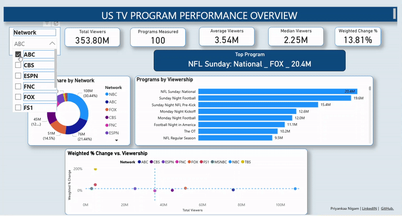

# US TV Program Performance Dashboard (Power BI)

This project analyzes the top 100 US TV programs to evaluate audience viewership, identify top performing programs, and measure competitiveness. The goal is to uncover insights into total/average/median viewership, audience share, and recent growth momentum using an interactive Power BI dashboard.
---

### Data Source:   
https://ustvdb.com/ratings on 10/6/2025

### Steps:
1.  **Data Cleaning & Transformation (Power Query)**:
    * Promoted headers and verified data types.
    * Cleaned program names for consistency (trimmed whitespance, fixed capitalization)
    * Addressed missig values in Change % by retaiig them as blank fields to avoid introducing bias in the growth trend analysis.
      
2.  **DAX Calculations**:
   
      Created key performance indicators (KPI): 
     * TotalViewers = SUM(channel_ratings[Viewers])
     * Weighted % Change = DIVIDE(SUMX(channel_ratings, channel_ratings[Viewers]*channel_ratings[Change]), [TotalViewers])
     * Top Program KPI = VAR t = SUMMARIZE(channel_ratings,channel_ratings[Program],channel_ratings[Network],"V", SUM(channel_ratings[Viewers]))
       VAR top1 = TOPN(1, t, [V],DESC)
       VAR prog = MAXX(top1, channel_ratings[Program])
       VAR net= MAXX(top1, channel_ratings[Network])
       VAR v= MAXX(top1, [V])
       RETURN prog & " _ " & net & " _ " & FORMAT(v, "0,,.0M")
       
3.  **Dashboard Design**:
    
      The dashboard features:
      * **KPI Cards**: Total Viewers, Average Viewers, Median Viewers, Weighted % Change, Top Program
      * **Network Slicers**: Filter viewership, audience share, weighted % change by network (NBC, ABC, CBS, FOX, ESPN, FNC, FS1, MSNBC, TBS)
      * **Visualizations**: 
        1. **Donut Chart:** Audience share by Network
        2. **Bar Chart:** Top programs by viewership
        3. **Scatter Plot:** Weighted % Change vs Viewership to highlight growth vs dominance.
           
 5.  **Publishing**:
    
      Published dashboard to Power BI Service for interactive exploration.

### Results
 [View the Interactive Dashboard Live](https://app.powerbi.com/view?r=eyJrIjoiNzg1ZDkwMzMtZWFjZi00YjBjLTg3MmQtNzM3YWE3MzRjMzFhIiwidCI6IjY2OTA5YjAzLWIxZDctNDNmYS05YmUyLTMzMmVmYzQ1YWUxMCIsImMiOjZ9)

### Key Insights

1. NBC secured the largest audience share (30.4%) acroos the top 100 programs.
2. TBS demonstrated the highest recent growth momentum.
3. NFL Sunday Night Football on FOX network ranked as the most watched program with 20.4M viewers.

### Tools

* **Power BI Desktop**
* **Power Query (M Language)**
* **DAX (Data Analysis Expressions)**

