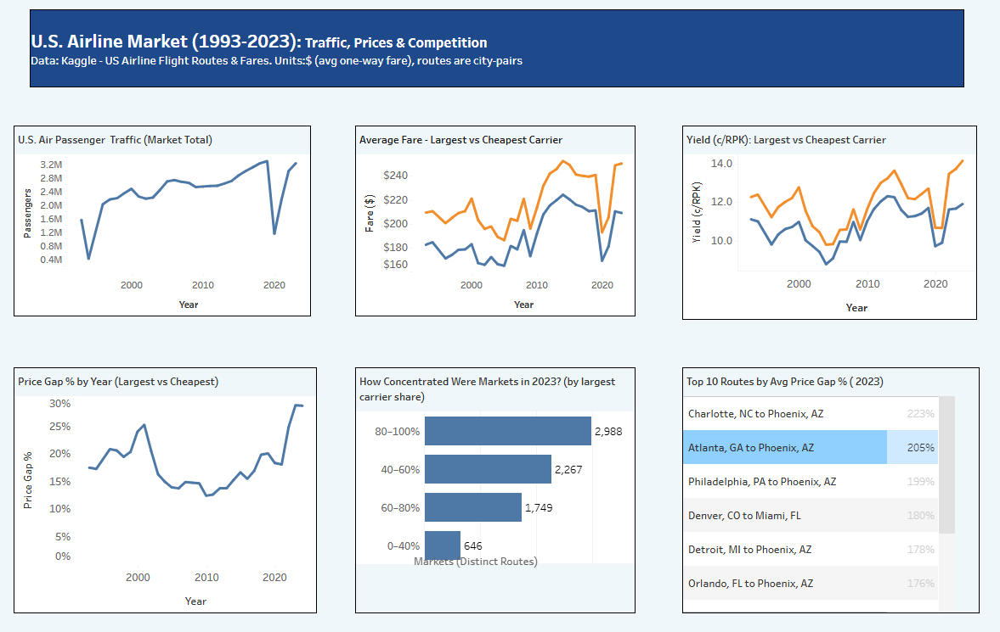

# U.S. Airline Market Analysis Dashboard (Tableau)

This project analyzes U.S. airline market to compare passenger traffic, pricing gaps (largest vs cheapest carrier), market concentration, and route-level outliers. Using historical data (1993-2023), I built an interactive Tableau dashboard to evaluate market structure and pricing dyanamics.
---

### Data Source:   
https://www.kaggle.com/datasets/amitzala/us-airline-flight-routes-and-fares

### Steps:

1.  **Data Preparation**:
    * Verified data types and removed irrelevant fields

    * Cleaned city names (removed "Metroplitan Area)" suffix

       [City 1 (short)] =TRIM(REGEXP_REPLACE([City1],'\s*\(.*\)', ''))

       [City 2 (short)] = TRIM(REGEXP_REPLACE([City2],'\s*\(.*\)', ''))
   
    * Built Route labels used in labels

       [Route] = [City 1 (Short)]+ " to " +[City 2 (Short) ]

    * QA check: Identified nulls in passenger, fare and marketshare records

                "Data through " + STR(INT(MAX([Year])))
          + " • Null pax: " + STR(SUM(IIF(ISNULL([Passengers]),1,0)))
          + " • Null fare: " + STR(SUM(IIF(ISNULL([Fare]),1,0)))
          + " • Null Largest fare: " + STR(SUM(IIF(ISNULL([Largest Carrier Fare]),1,0)))
          + " • Null Cheapest fare: " + STR(SUM(IIF(ISNULL([Cheapest Carrier Fare]),1,0)))
          + " • Null large_ms: " + STR(SUM(IIF(ISNULL([Large Ms]),1,0)))
          + " • Null lf_ms: " + STR(SUM(IIF(ISNULL([Lf Ms]),1,0)))
          + " • Rows: " + STR(COUNT([Tbl]))

    * Built valid row filter to only include rows without nulls

      [Valid Row - Fares] = NOT ISNULL([Cheapest Carrier Fare]) AND [Cheapest Carrier Fare] > 0
         AND NOT ISNULL([Largest Carrier Fare]) AND [Largest Carrier Fare] > 0

      [Valid Row - Shares] = NOT ISNULL([Large Ms]) AND [Large Ms] > 0
         AND NOT ISNULL([Lf Ms]) AND [Lf Ms] > 0

2.  **Calculated Fields**:
   
      Key Tableau calcualtions Used: 

     * // Price gap between largest and cheapest carrier

       [Price Gap %] = ([Largest Carrier Fare] - [Cheapest Carrier Fare]) / [Cheapest Carrier Fare]

     * // Market concentration buckets by largest carrier share

       IF ISNULL([Large Ms]) THEN "UNKNOWN"
       ELSEIF  [Large Ms] < 0.40 THEN "0–40%"
       ELSEIF [Large Ms] < 0.60 THEN "40–60%"
       ELSEIF [Large Ms] < 0.80 THEN "60–80%"
       ELSE "80–100%" END

     * // Distinct market count (routes)

       [Market (Distinct Routes)]= CNTD([Tbl1ApK]) 
         
3.  **Dashboard Components**:
    
      * **US Passenger Traffic (1993-2023)**: Airline growth trajectory over time
      * **Average Fare - Largest vs Cheapest Carrier**: Two-line comparison over time
      * **Price Gap % by Year)**: Average yearly % gap (largest vs cheaper carrier fairs)
      * **How concentrated were markets in 2023?**: Countof distinct routes by concentration bucket.
      * **Top 10 Routes by Avg Price Gap % (2023)**: Table of routes with their average price gap %
           
### Results
 [View the Dashboard on Tableau Public](https://public.tableau.com/app/profile/priyankaa.nigam/viz/U_S_AirlineDashboard/Dashboard1)

### Key Insights

1. **Passenger recovery** - Traffic plunged sharply in 2020 due to COVID-19 pandemic, but rebounded by 2023 to pre-pandemic levels.
2. **Pricing gap widened in recent years** - The average price gap % (largest vs cheapest carrier) showed an upward trend after 2010 and reached its highest level in 2023 (approx. 29%)
3. **High Concentation in 2023** - Most routes were concentrated, with the largest share falling in the 80-100% concentration bucket (by largest carrier share), suggesting that one carrier controlled most of the traffic in these routes.
4. **Route Outliers** - Several routes showed >150% price gap. Largest carriers charge more than double the price of cheaper carriers for routes such as Charllote, NC to Phoenix, AZ; Atlanta, GA to Phoenix, AZ.

### Tools

* **Tableau Desktop**
* **Excel/CSV**
